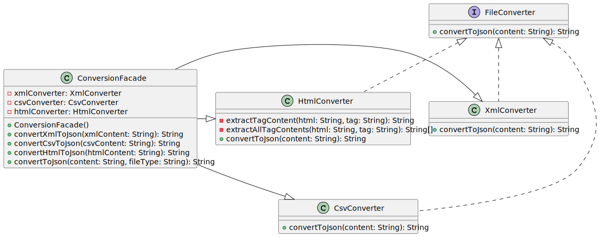

# Padrão de Projeto Facade

## Intenção

O padrão Facade fornece uma interface simplificada para um conjunto complexo de classes. Ele oferece um ponto de acesso que unifica o uso ao meu sistema, encapsulando a complexidade interna e expondo apenas as funcionalidades necessárias para o cliente.

## Motivação

Na implementação temos uma aplicação que converte diferentes tipos de arquivos para JSON, no nosso exemplo, temos 3 diferentes conversores de arquivos para JSON, sendo XML, CSV e HTML, cada um com suas próprias implementações complexas. Um cliente precisaria conhecer detalhes sobre cada um desses subsistemas para usá-los corretamente.

A classe `ConversionFacade` resolve esse problema:

- Oculta a complexidade de instanciar e gerenciar cada conversor individual
- Fornece métodos simples e diretos para acessar cada tipo de conversão
- Inclui funcionalidades de alto nível como detecção automática de formato
- Centraliza a interação entre o cliente e os subsistemas

Sem o Facade, o código do cliente ficaria assim:
```java
// Sem Facade - cliente precisa conhecer todos os subsistemas
XmlConverter xmlConverter = new XmlConverter();
String xmlResult = xmlConverter.convertToJson(xmlContent);

CsvConverter csvConverter = new CsvConverter();
String csvResult = csvConverter.convertToJson(csvContent);

// ...e assim por diante
```

Com o Facade, o código do cliente fica muito mais simples:
```java
// Com Facade - cliente tem uma interface simplificada
ConversionFacade converter = new ConversionFacade();
String xmlResult = converter.convertXmlToJson(xmlContent);
String csvResult = converter.convertCsvToJson(csvContent);

// Ou ainda mais simples com detecção automática:
String result = converter.convertToJson(content, "xml");
```

## Aplicabilidade

O padrão Facade é adequado quando:

1. Você precisa fornecer uma interface simples para um subsistema complexo, como nossa biblioteca de conversão de diferentes formatos
2. Você quer reduzir o acoplamento entre clientes e subsistemas
3. Você tem muitas dependências entre clientes e classes de implementação

Neste projeto, o padrão foi aplicado para simplificar a conversão de diferentes formatos de arquivo para JSON, encapsulando a lógica específica de cada formato em classes separadas e fornecendo uma interface unificada.

## Estrutura



## Colaboração

Em nosso exemplo:

1. O cliente (`Main.java`) interage apenas com a classe `ConversionFacade`
2. A fachada `ConversionFacade` instancia e gerencia os subsistemas (converters) conforme necessário
3. Os `Subsistemas` Quando um método de conversão é chamado:
   - A fachada verifica se o conversor apropriado já foi instanciado
   - Cria o conversor se necessário
   - Delega a operação para o conversor correspondente
   - Formata e retorna o resultado para o cliente

## Implementação

### Interface FileConverter

```java:app/FileConverter.java
package app;

interface FileConverter {
    String convertToJson(String content);
}
```

### ConversionFacade

```java:app/ConversionFacade.java
package app;

public class ConversionFacade {
    private XmlConverter xmlConverter;
    private CsvConverter csvConverter;
    private HtmlConverter htmlConverter;
    
    public ConversionFacade() {}
    
    public String convertXmlToJson(String xmlContent) {
        if (xmlConverter == null) {
            xmlConverter = new XmlConverter();
        }
        String result = xmlConverter.convertToJson(xmlContent);
        return "Resultado da conversão XML: " + result;
    }
    
    public String convertCsvToJson(String csvContent) {
        if (csvConverter == null) {
            csvConverter = new CsvConverter();
        }
        String result = csvConverter.convertToJson(csvContent);
        return "Resultado da conversão CSV: " + result;
    }
    
    public String convertHtmlToJson(String htmlContent) {
        if (htmlConverter == null) {
            htmlConverter = new HtmlConverter();
        }
        String result = htmlConverter.convertToJson(htmlContent);
        return "Resultado da conversão HTML: " + result;
    }
    
    // Método auxiliar para detectar formato e converter automaticamente
    public String convertToJson(String content, String fileType) {
        switch (fileType.toLowerCase()) {
            case "xml":
                return convertXmlToJson(content);
            case "csv":
                return convertCsvToJson(content);
            case "html":
                return convertHtmlToJson(content);
            default:
                return "Formato de arquivo não suportado: " + fileType;
        }
    }
}
```

### Subsistemas - Implementações específicas

```java:app/XmlConverter.java
package app;

class XmlConverter implements FileConverter {
    @Override
    public String convertToJson(String content) {
        System.out.println("Convertendo XML para JSON...");

        // Este é um exemplo simplificado de como extrair dados do XML
        String result = "";
        
        // Simulando extração de dados do XML
        if (content.contains("<root>")) {
            result = "{\"root\":{";

            String[] items = content.split("<item>");
            StringBuilder itemsJson = new StringBuilder();
            
            for (int i = 1; i < items.length; i++) {
                String value = items[i].split("</item>")[0];
                itemsJson.append("\"").append(value).append("\"");
                if (i < items.length - 1) {
                    itemsJson.append(",");
                }
            }
            
            result += "\"item\":[" + itemsJson + "]}}";
        }
        
        return result;
    }
}
```

```java:app/CsvConverter.java
package app;

class CsvConverter implements FileConverter {
    @Override
    public String convertToJson(String content) {
        System.out.println("Convertendo CSV para JSON...");
        
        // Dividindo o conteúdo em linhas
        String[] lines = content.split("\n");
        if (lines.length < 2) {
            return "[]";
        }
        
        // A primeira linha contém os cabeçalhos
        String[] headers = lines[0].split(",");
        
        StringBuilder jsonBuilder = new StringBuilder("[");
        
        // Processando cada linha de dados
        for (int i = 1; i < lines.length; i++) {
            String[] values = lines[i].split(",");
            jsonBuilder.append("{");
            
            // Associando cada valor ao seu cabeçalho
            for (int j = 0; j < Math.min(headers.length, values.length); j++) {
                jsonBuilder.append("\"").append(headers[j]).append("\":\"").append(values[j]).append("\"");
                if (j < Math.min(headers.length, values.length) - 1) {
                    jsonBuilder.append(",");
                }
            }
            
            jsonBuilder.append("}");
            if (i < lines.length - 1) {
                jsonBuilder.append(",");
            }
        }
        
        jsonBuilder.append("]");
        return jsonBuilder.toString();
    }
}
```

```java:app/HtmlConverter.java
package app;

class HtmlConverter implements FileConverter {
    @Override
    public String convertToJson(String content) {
        System.out.println("Convertendo HTML para JSON...");
        
        StringBuilder result = new StringBuilder("{");
        
        String title = extractTagContent(content, "h1");
        if (title != null) {
            result.append("\"title\":\"").append(title).append("\",");
        }
        
        String[] paragraphs = extractAllTagContents(content, "p");
        if (paragraphs.length > 0) {
            result.append("\"paragraphs\":[");
            for (int i = 0; i < paragraphs.length; i++) {
                result.append("\"").append(paragraphs[i]).append("\"");
                if (i < paragraphs.length - 1) {
                    result.append(",");
                }
            }
            result.append("]");
        }
        
        result.append("}");
        return result.toString();
    }
    
    private String extractTagContent(String html, String tag) {
        String openTag = "<" + tag + ">";
        String closeTag = "</" + tag + ">";
        
        int start = html.indexOf(openTag);
        if (start == -1) return null;
        
        start += openTag.length();
        int end = html.indexOf(closeTag, start);
        if (end == -1) return null;
        
        return html.substring(start, end);
    }
    
    private String[] extractAllTagContents(String html, String tag) {
        String openTag = "<" + tag + ">";
        String closeTag = "</" + tag + ">";
        
        java.util.List<String> contents = new java.util.ArrayList<>();
        int startIndex = 0;
        
        while (true) {
            int start = html.indexOf(openTag, startIndex);
            if (start == -1) break;
            
            start += openTag.length();
            int end = html.indexOf(closeTag, start);
            if (end == -1) break;
            
            contents.add(html.substring(start, end));
            startIndex = end + closeTag.length();
        }
        
        return contents.toArray(new String[0]);
    }
}
```

### Código Cliente

```java:Main.java
import app.ConversionFacade;

public class Main {
    public static void main(String[] args) {
        // Criando o Facade
        ConversionFacade converter = new ConversionFacade();
        
        // Definindo conteúdos de exemplo
        String xmlContent = "<root><item>Valor XML</item><item>Outro valor XML</item></root>";
        String csvContent = "nome,idade,cargo\nJoão,30,Analista\nMaria,25,Desenvolvedora";
        String htmlContent = "<html><body><h1>Título Principal</h1><p>Primeiro parágrafo</p><p>Segundo parágrafo</p></body></html>";
        
        // Testando método com detecção automática
        System.out.println(converter.convertToJson(xmlContent, "xml"));
        System.out.println(converter.convertToJson(csvContent, "csv"));
        System.out.println(converter.convertToJson(htmlContent, "html"));
            
        // Testando formato não suportado
        System.out.println(converter.convertToJson("conteúdo", "pdf"));
    }
}
```
